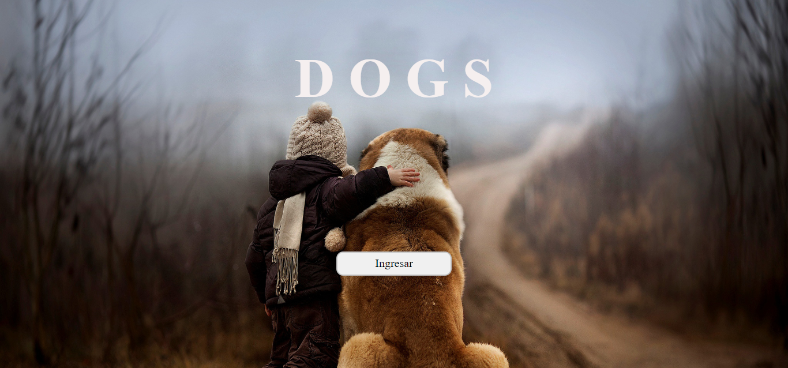
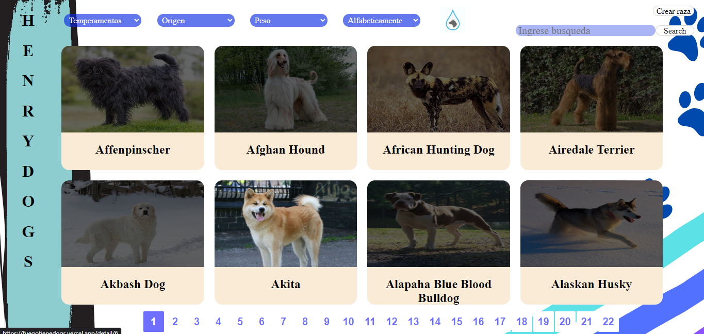
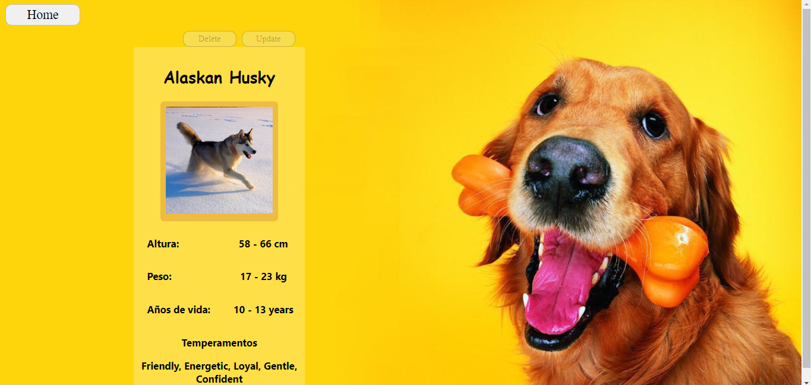
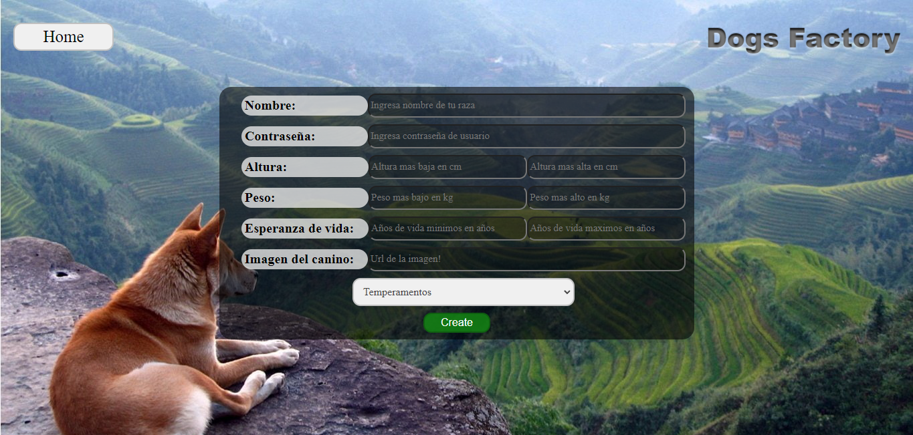
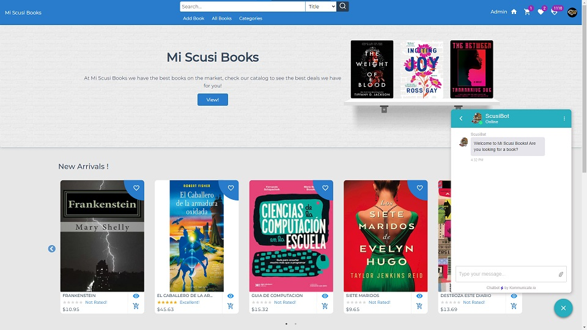
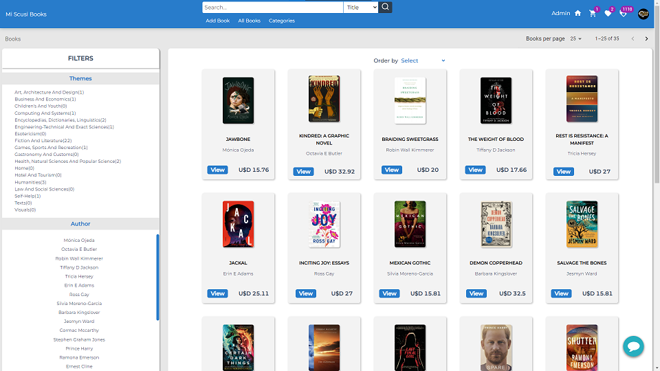
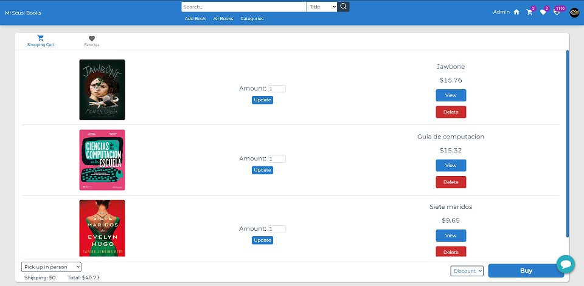
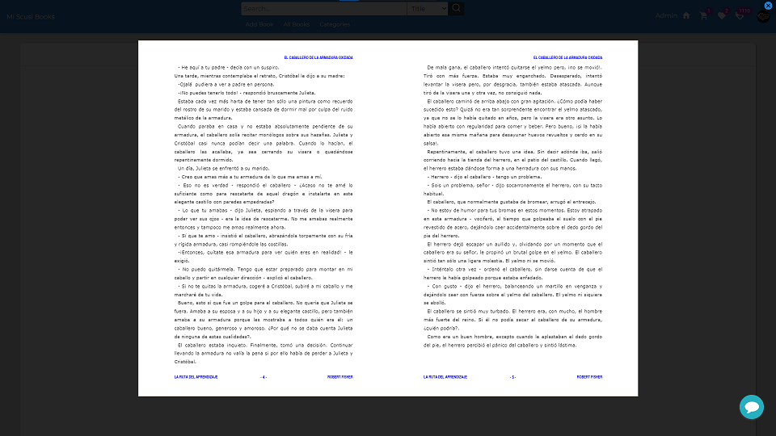

<h1>Hi 👋, My name is Juan Franco Ledesma</h1>
<h3>A Full Stack Developer graduated from Henry!</h3>

## ✨ Skills ✨

## ✨ Projects ✨

<a href="https://github.com/JuanFrancoLedesma/PI-Dogs">🐶 Dog App 🐶</a>
 
<a href="https://fuegotienedogs.vercel.app/home">🦴 Visit site 🦴</a>

<a href="https://github.com/AlejandroGCorzo/Mi-Scusi-Books">📚 Mi Scusi Books App 📚</a>
 
<a href="https://mi-scusi-books.vercel.app/">😎 Visit site 😎</a>

## ✨ GitHub Stats ✨

&nbsp;

### Contact 💼

<a href="https://mail.google.com/mail/?view=cm&fs=1&to=juanfledesma18@gmail.com">

